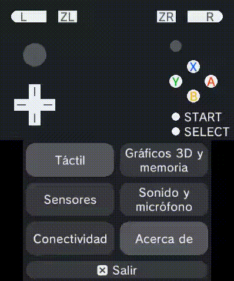

# 3Dtrident

Es una aplicación de videoconsola retro cuya función es probar el funcionamiento del *hardware* y facilitar otras propiedades de *software*.

# Demostración



# Objetivos

- [ ] [LO SIGUIENTE] Crear menú principal.
- [ ] [POR ACABAR] Pantalla para probar la entrada del *hardware* como _joysticks_, gatillos, cruceta...
- [ ] [AHORA] Pantalla para probar el táctil de la consola mediante un _paint_.
- [ ] [~] Apartado en donde _testear_ el micrófono, audio y volumen.
- [ ] [~] Comprobar el funcionamiento de la función _3D_ de la pantalla de la pantalla superior.
- [ ] [~] Pantalla de acerca de la aplicación.
- [ ] [~] Página en la que verificar el correcto funcionamiento de sensores.
- [ ] [~] Exportación en formato instalable. Extender Makefile.

# Estructura del proyecto

### Application

Punto de entrada de la aplicación.

### Hardware

Interfaz entre la I/O de la consola y el programador. Leer botones, *joysticks*, pantalla táctil, giroscopio...

### Pages

Interfaz para la declación de páginas y el manejo de estas. Basada en el funcionamiento de una máquina de estados finitos.
Para declarar nuevas páginas:

```c
// pages.h
extern Page PAGE_MYPAGE;

// page_mypage.h
extern Page PAGE_MYPAGE;

// page_mypage.c
static EntryPage entry (); // la función entry puede llamerse cómo quiera. Recomendable que sea static y no declararla en su .h.
Page PAGE_MYPAGE = entry;
```

# Compilación y contribución

Es necesario tener las librerías de desarrollo instaladas. Consulta [este sitio](https://devkitpro.org/wiki/Getting_Started).
Si trabajas desde un sistema _UNIX-like_, configura `pacman` siguiendo las instrucción de la wiki e instala el grupo `3ds-dev` para este proyecto.

Ubícate en la carpeta raíz del proyecto y sigue los siguientes comandos:

## Autocompetado de código

Puedes usar un archivo de configuración para el autocompletado de código. Para ello, debes tener instalado `clangd`. Más información [aquí](https://github.com/clangd/clangd).

Genera el archivo de configuración ejecutando:

```sh
make .clangd
```

Si eres usuario de windows, quizás te toque revisar manualmente el archivo generado.

## Generando el ejecutable

Genera el archivo ejecutable escribiendo:

```sh
make
```

Obtendrás en el directorio raíz al menos 2 archivos, `.3dsx` y `.elf`. Ejecuta cualquiera de los dos en la consola.

## Ejecuando simulación

Compila y carga automáticamente el binario obtenido.

```sh
make emulator
```

Es **fundamental** que revises y adaptes el `Makefile` para un mejor flujo de trabajo con el programa de emulación de
preferencia.

## Depuración

Puedes depurar el programa obtenido con el depurador facilitado por [[devkitPro](https://github.com/devkitPro)].
Consulta los parámetros del `Makefile` para adaptarlas a las características de un trabajo.

```sh
make debug
```

En primer lugar, este comando hace lo mismo que `make emulator`. Por lo que necesitarás de un emulador de la consola.
Aunque si lo prefieres es posible usar una videoconsola para la depuración. Investiga por tu cuenta para esto.

En segundo lugar, la orden indicada se diferencia en que inicia el entorno de emulación en modo depuración. Este modo
consiste en que la aplicación de emulación usada abre un servidor en local en un puerto (`localhost:port`) a la escucha
de peticiones. Este tipo de peticiones son *breakpoints*, detener la ejecución, inspeccionar el valor de variable... del
depurador.

Es importante que el programa que vaya a simular la ejecución tenga conexión de red local.

En tercer lugar, la consola donde hayas ejecutado esta instrucción será en la que vayes a operar con el depurador GDB.

## Estilo de código

- Estilo de código **GNU**. Emplea un formateador de código como `clang-format`.
- Por convención: cada función de un módulo que pueda ser usada por otros módulos, su signatura deberá de empezar con el nombre del módulo. Formato `<type> Module_func (<args>)`.

# Motivación

La razón de llevar a cabo este proyecto es la conservación de la consola. Así como el estudio de las capacidades y limitaciones de la misma.
Facilitar la consulta y comprobación de funciones y propiedades de la consola al usuario final.
Por diversión, por amor al arte, por el *software* libre y por mejorar habilidades en el desarrollo de programas de bajo nivel.

# Créditos

- devkitPro [[github](https://github.com/devkitPro)] por las librerías de desarrollo para la consola.
- Inter [[github](https://github.com/rsms/inter)] por la tipografía personalizada empleda.
- Inspirado en 3DSident [[3DSident](https://github.com/joel16/3DSident)].
